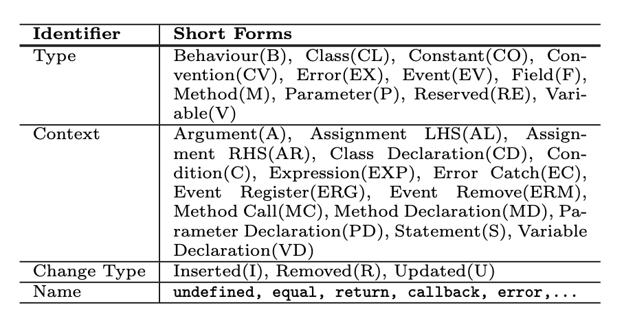

### Lexing and Parsing

- **rustc_lexer**
  - source text $\rightarrow$ tokens
- **rustc_parse**
  - input : token stream (还无法进行parse) $(\rm rust\_parse::lexer)\rightarrow$ 可以被parse的token
  - **StringReader**
    - a set of validations
    - string interning

## Coding

### code/search.py 爬取仓库
```shell
python3 search.py repos.txt
```

使用如上指令，将遍历repos.txt中的所有仓库

获取仓库改动流程：

1. 读取仓库名
2. 遍历仓库中与后缀名为.rs（即rust源代码文件）的commit
3. 遍历每个commit中改动的.rs文件 （过滤其它类型的文件），并过滤掉改动前/改动后的文件缺失的情况（即文件级别的add/delete的情况）
4. 获取改动前后的method信息（名称、在源文件中的起始行与结束行），并过滤出**在文件改动前后都出现**的method（即过滤掉method被add/delete的情况，仅保留modify）
5. 获取到改动前后的method源代码，并存入文件，文件排布为 仓库——commit——改动文件——method\_改动前、method\_改动后

​	变量root_dir为生成改动代码的根目录。

#### 筛选条件：

**改动条数在6行以内，**

**TODO: commit message关键词**


### code/process.py 生成数据集

对前面获取的每个仓库改动代码文件，

- 使用code/difftastic
  - 进行diff
  - 进行

### code/gen_ast.py 

对前面获取的每个仓库改动代码文件，

使用code/get_tree进行parse，生成对应的AST并以相同的文件排版存储

变量root_dir为生成的AST的根目录。


```shell
code/get_tree/目录下：
cargo build
code/目录下：
python3 gen_ast.py
```


### code/get_tree 生成AST

- tree-sitter::parser::parse()：将源文件转化为tree-sitter::Tree
- tree-sitter::Tree.walk(): 获取TreeCursor用以遍历Tree


#### 生成的AST

**获取的tree-sitter::Tree节点类型：**

- 首先每个源文件中的内容都是一个function，所以Tree的最顶层的两个节点是
  - source_file
    - function_item
      - fn
      - identifier
      - parameters


### code/gen_diff.py 生成code diff信息

对于获取的每个仓库改动代码文件，使用difft指令生成改动前后代码的diff信息，并重定向写入文件。

```shell
code/目录下：
python3 gen_diff.py
```


### **difftsatic**

```shell
difft --display side-by-side-show-both --context 0 test1.rs test2.rs
```

- --display：显式模式：side-by-side-show-both：显式改动前后的对照

- --context：显式的源代码改动中包含的上下文行数

- 显示的内容：

  - 若前后代码没有语义上的区别，那么会显示：

    ```shell
    test2.rs --- Rust
    No syntactic changes.
    ```

    第一行是输入的后一个的文件路径与源代码所用语言的标识 --- Rust

    第二行是No syntactic changes的提示

  - 若前后代码只有一处改动（TODO：这里判断一处还是多处是由工具中的算法决定的），那么会有形如如下的显示：

    ```shell
    test2.rs --- Rust
    2     let b = 1;                                                     2 
    3                                                                    3 
    4     let s = String::from("23");                                    4     let s = String::from("123");
    .                                                                    5 
    .                                                                    6     let a = 2;
    .                                                                    7 
    5     if (b >= 0){                                                   8     if (b == 0 && b > 1){
    ```

    第一行和前面的一样，后面就是两个文件中的代码不同比较；

    TODO：如何判断是否是同一种变化？

    重定向后写入的文件中 同一行中前后都出现的代码表示前后的改动对应，其他的均为insert/remove
    
  - 若前后代码不止一处改动，显示的内容如下
  
    ```shell
    test1_after.rs --- 1/2 --- Rust
    11         _ => unreachable!("unhandled x500 attr")                                                                                                          11         _ => unreachable!("unhandled x500 attr {:?}", oid)
    
    test1_after.rs --- 2/2 --- Rust
    17         _ => unreachable!("unhandled x500 value type")                                                                                                    17         _ => unreachable!("unhandled x500 value type {:?}", valuety)
    
    ```
  
    比只有一处改动的显示，多了一个当前改动的计数1/n，2/n，...


### difftsatic处理过程

*：仅针对

```shell
difft --display side-by-side-show-both --context 0 test1.rs test2.rs
```

，即比较两Rust的代码源文件

#### 准备工作（略）

- 参数解析
- 检查指令正确性
- 最顶层调用diff_file()获取diff结果
- diff_file()：
  - 读取输入的文件，做检查
  - 调用diff_file_content()
- diff_file_content()
  - 检查
  - 设置语言和config
  - 判断两文件是否相同
  - 检查config
  - 根据config进行parse，调用to_tree_with_limit()获取代码的tree-sitter::Tree
    - 主要输入：源代码
    - 输出：**Tree**
  - 对于获得的两个文件对应的两棵tree，调用to_syntax_with_limit()获取代码的syntax tree，以Vec<&Syntax>
    - 主要输入：两个源代码文件的Tree
    - 输出：**两个源代码文件的Vec<&Syntax>**
    - to_syntax_with_limit()中调用to_syntax()方法，获取Vec<&Syntax>，usize元组，其中usize代表Tree中error的节点个数，这里我们不考虑。
- to_syntax()
  - 检查
  - 调用tree::walk()获取TreeCursor以遍历tree
  - cursor.goto_first_child()方法将cursor指向Tree的root
  - 然后调用all_syntaxes_from_cursor()

- all_syntaxes_from_cursor()
  - 主要输入：cursor
  - 输出：**Vec<&Syntax>**
  - 用一个loop，对空的Vec不断extend()，直到cursor.goto_next_sibling()为空
    - extend中调用用syntax_from_cursor()方法返回一个Option<&Syntax>
- 获取的**Vec<&Syntax>**是DFS前序遍历的结果，并存储了children的关系
  - 继续处理，根据子孙关系设置节点间的前-后关系

- 原本的判断hunk的方式：（格式化后）若改动前或改动后对应的源代码中的两个内容对应的差了一个阈值的行数时，就判定为另一个改动，若在4行以内，则为同一处改动


- 现在能有的：
  - 源代码中改动前后对应的行的map
  - 前后两棵tree-sitter::Tree
    - todo：如何遍历？
  - 对tree-sitter::Tree做处理后用于diff的 Vec<&Syntax>
    - 在我们的项目中，对于1个function，Vec中只有一个节点，是一个List类型
    - 没有节点类型信息（这里是指比如if、while类型这样应该是一个控制流类型的节点），单纯是一个树的模型，包含了字符串和位置的信息
  - 
- 想要搞得：
  - 源代码改动前后对应的tree节点


### 特征向量抽象：

- change type：
  - insert：使用difftsatic获取的的前后改动中 左边没有，右边有
  - delete：使用difftsatic获取的前后改动中 左边有，右边没有
  - update：使用difftsatic获取的前后改动中 左边有，右边也有
- context：
  - 使用TreeCursor在tree-sitter::Tree中遍历




## 跑起来可能会crash的点：

- tree-sitter::parse语法分析器解析失败


### 需要进行改动以比较的参数

- commit中修改的代码行数（search.py  LINES_THRESH）
- 将代码改动划分成不同hunk时用于判定不同行的改动是否算成同一处改动的标准
  - 行数：k  （hunks.rs ：MAX_DISTANCE）
    - 比如k = 4时，改动前的第1行对应改动后的2，3行，改动前的第5行对应改动后的4，5行。这样相差了4行，将其判定成两处改动
      反过来 改动前的23对应改动后的1，然后下一块对应改动后的5，它也是判定为两处
  - 更加精确的判断
    - 根据语法树的节点进行判断


RQ：

- Rust项目中有哪些频繁改动的bug模式？
- 上述模式中哪些是Rust中特有的？


