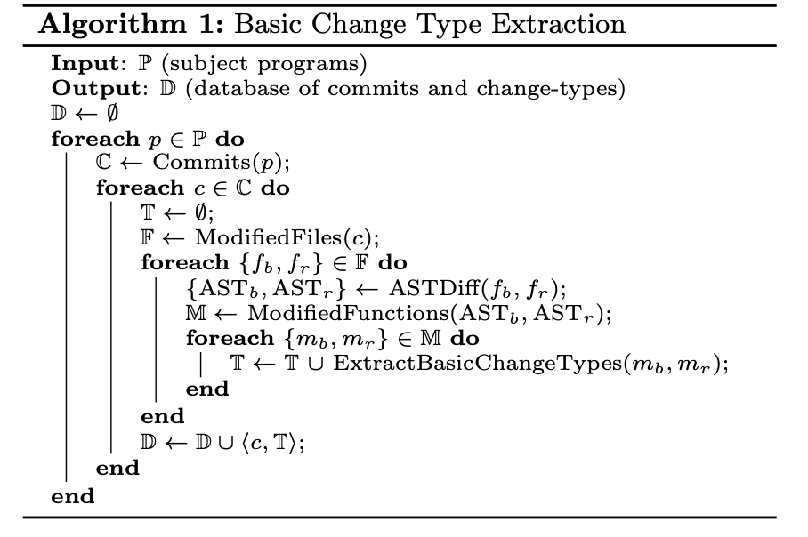
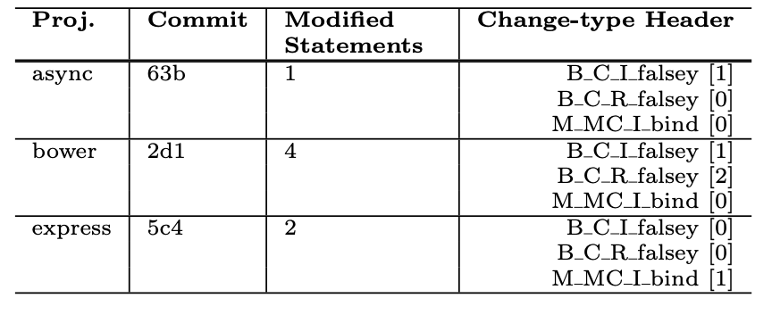

- 一种基于**语言结构变化**的自动学习bug修复的变化类型的技术
- 主要研究对象是跨项目的bug pattern（cross-project bug patterns）

- 如何自动发现高频出现的bug pattern？

  - 找那些被频繁修改的bug pattern——基于源代码的历史change
    - 问题：有些bug修复可能要花上开发者很长时间、很多个commit —— 人工检查代码修改不现实
    - 解决：减小搜索的范围 —— 基于bug的修复来为bug pattern进行归类。
    - 基于commit而不是bug report：commit一般都会指向对应的bug report，并且有时候开发者不会报bug report
  - 具体：只考虑修改量在1-6条statement的commit （研究表明**频繁的cross-project**的bug修复一般每次修改6条或以下的语句）

- 筛出来的commit还会有很多非频繁的bug，很难人工检查，所以要考虑自动化group related bug pattern的方法

  - 输入：很多包含了1-6条语句修改的commit
  - 输出：分好类的高频bug fix pattern的commit
  - **聚类**（事先不知道会有哪些pattern类型） detect **unknown** change types

- 如何学习**Basic Change Types (BCTs)**

  - 对BCT的抽象：

    - language construct type：被修改的部分的类型，包括保留字、api接口、行为等
    - language construct context：语言结构的上下文，比如保留字this指针，不同的this指针所处的上下文都不相同（在条件分支中/作为参数传递等）
    - modification type：commit中代码结构是如何被修改的——使用source code differencing tool计算
    - name：给这个语言结构的命名

    

  - 一种change type可能由一个或多个BCT构成

- **Extract Basic Change Types**

  - 对每个程序的每个commit，先抽取出改动前后的文件对(bug文件，repair后的文件)
  - 然后对每个文件对使用AST differencing方法获取AST对(bug的AST，repair后的AST)
  - 对每个AST对，抽取出在两个AST中都出现的function（忽略掉insert和remove的function是因为它们被insert/remove的原因大概率是重构而不是修复bug），获得function对（buggy function, repaired function）
  - 通过分析每个function对，获得BCT；每个commit可能有多个BCT，将（commit，相关的BCTs）存入数据库
  - 过滤出如下的commit：
    - 包含1-6条语句改动
    - 在message中不包含“merge”的字样
    - 至少有一个BCT的上下文类型不是“S”（参见上表）
    - 至少有一个BCT的change type不是“U”（参见上表）

  

  - 
  - 上图是dataset中的三个条目，每个条目是一个特征向量，其中change-type header代表[Type]-[Context]-[Change]-[Name]，后面数字代表出现次数

- 聚类并排序

  - 聚类算法使用DB-SCAN
    - 基于密度的算法
    - 不需要事先输入聚类的个数
    - distance function: Manhattan distance
  - 对change type做ranking，基于：
    - 出现在的项目个数
    - 出现在的commit个数

- 审查

  - 人工审查只看那些在5个或超过5个commit中的、超过1个的项目中的change type
  - 基于扎根理论，用系统化的审查方法在change type中总结bug pattern
    - sampling：对每种change type，在每个project中随机抽取一个commit作为该种change type的sample。比如某种change type出现在了40个项目的100个commit中，那么sample共有40个 —— 目的是为了找出cross-project的bug pattern，所以单个project中的change不能找太多
    - summerizing：记录每个conmit的信息：包括代码行的变化、message、bug report的链接（如果有的话），summary中包含了bug pattern的描述（即bug与修复的内容）
    - grouping：基于前面每条bug与修复的描述，对bug pattern进行分组
    - reviewing：全部分组好之后检查是否需要合并/分离出一些group

- **RQ**
  - **What basic change types exist in JavaScript?**
  - **What change types exist in JavaScript?**
  - **What pervasive bug patterns exist in JavaScript?**

