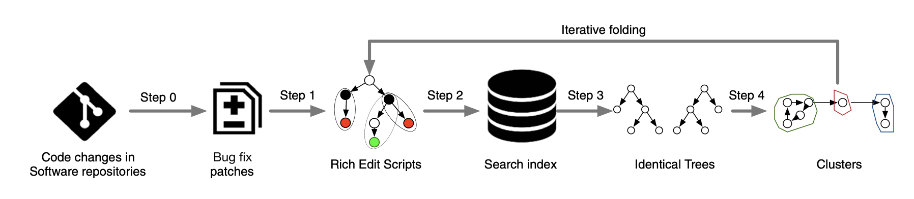
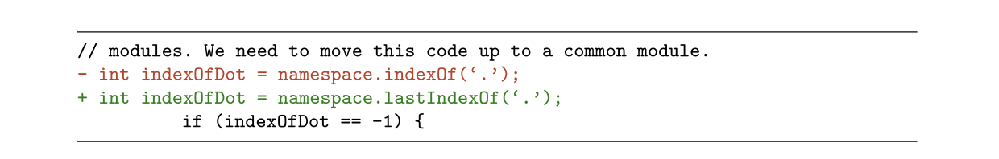
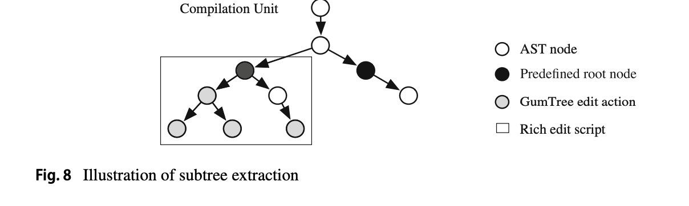
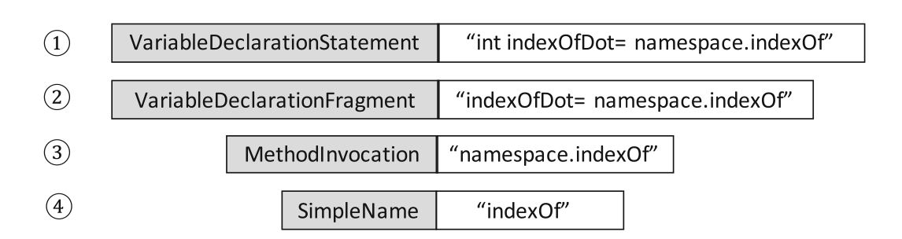
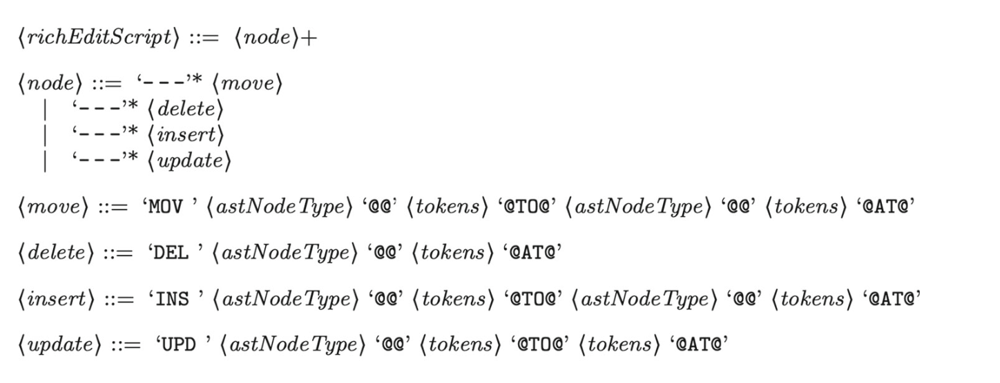
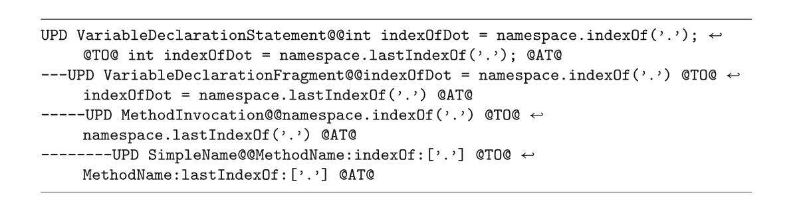

- Fix patterns 挖fix patterns并应用到实际的bug fix中——**Automated Program Repair**
- 挖掘出来的fix ppatterns是tractable、reusable的即可以输入到其他APR系统中来做对应模式的修复工作
  - 即mining后应用到现实的repair system中去
- 仓库中文件改动的粒度过大（对应代码行的修改），需要细粒度的内容（比如AST节点的变化）

- **edit script**：一系列的edit actions，用来描述以下的代码变化

  - **UPD**：$upd(n, v)$：将AST的节点$n$的旧值替换成新值$v$
  - **INS**：$ins(n,n_p,i,l,v)$ 插入一个值为$v$、label为$l$的新节点$n$, $n_p$代表该节点的parent，$i$表示$n$是$n_p$的第$i$个孩子，如果没有指明parent，那么$n$是根结点
  - **DEL**：$del(n)$表示从树上删除一个叶节点$n$
  - **MOV**：$mov(n,n_p,i)$表示以$n$为根结点的子树移动到$n_p$的第$i$个子女位置

  一个edit action包含了对应的节点、上述几种操作、change中涉及到的token。（这里的token就是用string描述的节点的值）

- **tangled patch**：理想情况下程序的一个patch是用来修复代码中的一个简单的问题。但是真实项目中一次patch可能是做了一个比较繁杂的工作，比如进行了多个不相关的code change来进行重构/提升性能等。这种情况也被称为mixed-purpose fixing commits，实证研究表明11%-39%的commits是tangled的

  - 比如一个commit中既修复了一个bug，又顺手把一个打印字符串中的错别字改了，两者毫无关联，就造成了tangled patch。所以需要从一个commit中提取出single code hunks，避免噪声对code change的影响。

- **Approach**

  

  - **step0：patch collection**：定义一个patch为原程序到新程序的转化，以修复某种漏洞/bug，用一个程序对$(p,p^{'})$表示，分别代表修改前/后的程序，更具体来说，一个patch代表源代码文件中的code block上的changes

    - 使用bug linking策略，将commits和相应的bug report link起来
      - 具体方法：爬项目的bug report，分两步
        - 检查项目的commit logs，找到bug report的ID，将bug report和对应的commit关联起来
        - 检查bug report：是否被打上了“BUG”的标签，是否被标记为“resolved”/“fixed”，并且处于完成的“closed”状态
    - 然后找出那些只用一个commit就修好的bug report，形成一个patch set（即每个bug不会涉及到多个commit）
    - 最后再过滤一次：只要那些在源代码中的修改，即过滤掉在配置、文档、测试文件中的修改

  - **step1：Rich Edit Script Computation**

    - 定义Rich Edit Script：patch中的一棵tree of changes，树上的节点都是收到patch影响的AST节点，描述了在AST上发生的操作，并与改动前后的code block相关联，即改动前后的code block AST

      - Rich Edit Script中的节点包含了三种类型的信息：Shape、Action、Token

    - 我们前面收集的patch是以源代码文件级别的改动来表示的，是粗粒度的，这一步是获取细粒度的内容，本篇选用了**GumTree AST** differencing tool 来从改动前后的AST中获得改动信息

    - 虽然但是，有很多的上下文信息是丢失的，即描述patch的预期行为的上下文信息。

      

      

      对于上面的patch信息，Gumtree给出的内容只是UPD并指出修改的label，而原文中的函数调用信息、接受该函数调用的返回值的变量、甚至是变量（或返回值）的类型int都没有体现出来。所以获得的edit script并不能体现这里代码变化的语法和文法的意义。

    - 所以本文中向Gumtree形成的edit script中添加了更多的AST-level的上下文信息。

    - 对Gumtree生成的edit scipt中的每一个edit action，在原AST中抽出一个最小生成树，将edit action作为该最小生成树的叶子结点，下面几种节点中选出一种作为该生成树的根节点：

      - TypeDeclaration
      - FieldDeclaration
      - MethodDeclaration
      - SwitchCase
      - CatchClause
      - ConstructorInvocation
      - SuperConstructorInvocation
      - any Statement node

      目的是为了尽量缩小改动部分的上下文信息的作用域，否则可以一直找到整个程序体

      

    - 具体操作：

      - 对生成的edit action，将其重新映射到源程序AST中的响应节点
      - 从edit action节点开始，自底向上遍历AST，直到遇到了predefined根节点
      - 对每个到达的predifined节点，抽出以之为根节点AST子树

      

      比如前面的例子，就是从SimpleName往上一直找到“VariableDeclaration**Statement**”，然后抽出这棵子树生成新的edit action，一系列的新edit action形成Rich Edit Script

      语法：

      

      对应示例：

      

      每加三条杠表示子女，@@后是原来的token，@TO@后面是修改后的Token

  - **step2 Search Index Construction**

    - 为了减轻匹配相似patch的复杂度，使用**SI（search index）**：**{Shape, Action, Token}**定义一个search index：$SI_{Shape},SI_{Action},SI_{Token}$，具体定义：$SI_*:\ Q_*\rightarrow 2^{RE}$，其中$RE$是Rich Edit Script的集合，$Q$是查询的集合
      - shape是节点类型（比如上面的VariableDeclaration...），Action是前面的DEL、MOV、UPD之类的，token是具体的值的改动（@@和@TO@之间的是buggy的token，@TO@和@AT@之间的是fixed token），一个edit action树又可以根据{shape, action, token}分成三棵树
    - 为什么？因为考虑到我们是为每个patch的每个hunk计算Rich Edit Scripts，它们可能是patch内部的，也可能跨patch。如果直接比较每一对Rich Edit Scripts的话会带来指数爆炸的问题。所以**SI**就是为了减少比较的space并enable a fast identification
    - 每一种tree的SI build：
      - Shape search index：输入所有的Rich Edit Scripts的ShapeTree，基于树的结构进行分类——将根节点相同（比如IfStatement、MethodDeclaration等）且深度相同的tree分成一组，为每一组的成员枚举出两两比较的结合，最终得到shape的SI：每一组都有一个
        - id：用root node type/depth的形式表示，比如IfStatement/3, MethodDeclaration/4
        - 指针，指向枚举出组内成员两两比较的combination所形成的一个比较空间
      - Action search index：要对ShapeTree再做一个聚类，即分组还要依据tree的shape
        - id：root node type/depth/ShapeTreeClusterId，比如IfStatement/2/1, MethodDeclaration/2/2
      - Token search index：要对ActionTree再做一个聚类，即分组还要依据tree的action
        - id：root node type/depth/ShapeTreeClusterId/ActionTreeClusterId，比如IfStatement/2/1/3, MethodDeclaration/2/2/1

