### 一、Memory Access Reorder

- cpu多级指令流水线（以五级为例）

  - 同时执行
    - 取指令
    - 指令译码
    - 执行指令
    - 内存访问
    - 数据写回
  - 可以在一个时钟周期内同时执行五条指令的不同阶段

  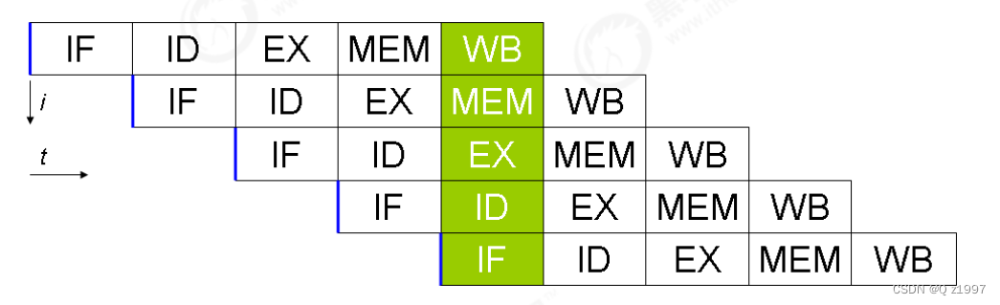

- 通过乱序执行，CPU可以在执行指令的同时，预先处理后续指令的执行，以避免因某个指令等待某个资源而导致的等待时间浪费。

```c
int A = 0;
int B = 0;

void fun() {
    A = B + 1; // L5
    B = 1; // L6
}

int main() {
    fun();
    return 0;
}
```

对应的汇编：

```assembly
movl    B(%rip), %eax
addl    $1, %eax
movl    %eax, A(%rip)
movl    $1, B(%rip)
```

g++ -O2 test.c生成的汇编：

```assembly
movl    B(%rip), %eax
movl    $1, B(%rip)
addl    $1, %eax
movl    %eax, A(%rip)
```

- 编译器只需要保证**在单线程环境下，执行的结果最终一致就可以**，所以，指令乱序在单线程环境下完全是允许的。对于编译器来说，它只知道：在当前线程中，数据的读写以及数据之间的依赖关系。

### 二、Introduction

- Rust中的类型系统使用一套严格的标准来限制**指针别名**，这种限制用来保证数据竞争等安全性，从而给指令重排的程序优化提供便利

```rust
fn example1 (x: & mut i32 , y: & mut i32 ) -> i32 {
  *x = 42;
  *y = 13;
  return *x; // Has to read 42, because x and y cannot alias !
}
```

Rust中，两个可变引用一定不是互为别名的关系，所以*x一定是42，那么return *x可以被优化成return 42；\*x和\*y的赋值语句可以随意调换位置。

但在别的语言中，这样的别名信息很难去获取：比如对于上述代码，换到C/C++中，无法确定x和y是否是别名关系。

- 但是，Rust的unsafe代码可以跳过借用规则

```rust
fn main () {
  let mut local = 5;
  let raw_pointer = & mut local as * mut i32;
  let result = unsafe { example1 (& mut * raw_pointer , & mut * raw_pointer ) };//cast *mut i32 back to &mut i32
  println !("{}", result ); // Prints "13".
}
```

​		

- 所以需要定义一套规则：只要用户遵守这套规则，即使指令重排的优化开启，也可以保证程序原本的语义不被改变。

- **Stacked Borrows——borrow checker的动态版本**

  - 定义了别名的规则，对于所有违背了该规则的程序，都会产生未定义行为。

  - 现有的Rust编译器语义规则下，上述样例代码将输出13 $\rightarrow$ 需要向语义规则中添加一些行为，告诉编译器它们是未定义行为；当然也不能添加太多——太严格就又变成safe Rust了

  - 静态检查的借用规则：

    - 同一时刻同一变量只能拥有1个可变引用或任意个不可变引用
    - 引用(reference)只能在其生命周期内被使用
    - 被引用的对象(referent)只能在loan的生命周期结束时被使用

    ```rust
    let mut v = vec ![10 , 11];
    let vptr = & mut v [1]; // Points * into * v. <-------------------------+
    v. push (12); // cannot borrow `v` as mutable more than once at a time  | lifetime of vptr and loan of v[1] 
    println !("v[1] = {}", * vptr );  <-------------------------------------+
    ```

    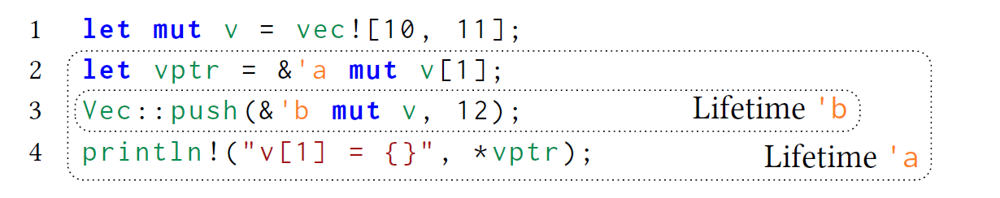

  - 2、3两行reorder：

    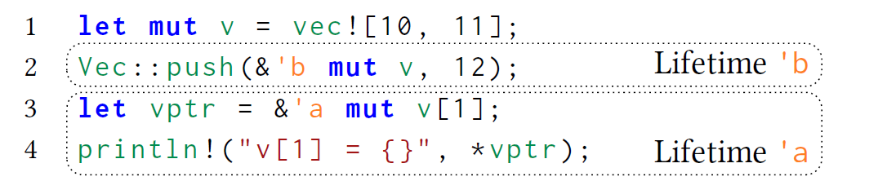

    或者说，同一个变量的reference的生命周期不能有重叠

  - **reborrow**：利用reference创建一个新的reference：嵌套生命周期

    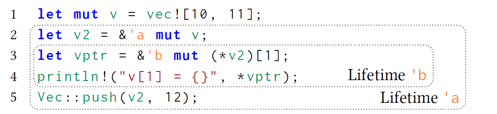

    如果在第五行后面再使用一次vptr，即lifetime 'b超出了'a的范围，那么就出现之前例子中一样的错误

  - **shared references**：不可变引用
  
  - **raw pointer**：裸指针


- 动态程序分析：使用per-location stack，不使用borrow checker的lifetime
  - why not lifetime？
    - lifetime的推导一直在变化 old AST-based borrow checker $\rightarrow$ non-lexical lifetimes $\rightarrow$
    - 借用检查之后lifetime就没了，编译优化阶段无法获取这个信息。


### 三、Stacked Borrows —— built up incrementally

#### 1、考虑Rust中只有mutable reference的情况

- 静态borrow checker需要保证：

  - a reference and all references derived from it (reborrow) can only be used during its lifetime
  - the referent does not get used until the lifetime of the loan has expired.

- 去掉lifetime这个概念，上面的规则可以写成：

  - 对于所有的引用（以及从该引用derived出来的引用），其**使用必须出现在被引用对象的下一次使用之前** —— 栈！！

  **stack principle **

  ```rust
  let mut local = 0;
  let x = & mut local ;
  let y = & mut *x; // Reborrow x to y.
  *x = 1; // Use x again .
  *y = 2; // Error ! y used after x got used .
  ```

  y的使用必须嵌套在x的两次使用中间

  定义-使用序列：xyxy不合法，xyyx合法

- 如何维护这样一个borrow stack？

  - 每当一个reference被创建时，将其push进来
  - 每当一个reference被使用后，它应该出现在栈顶；即不断对栈进行pop，直到该reference来到栈顶。
    - 对于被pop掉的reference——再也无法使用，如果使用就违背了规则


#### 2、Make the model more operational

 ${\rm Pointer}(l,t)$代表指向内存地址$l$，标签为$t$的指针（raw pointer或reference都可以），每个指针都有一个unique的标签ID，记为$t$

${\rm Unique}(t)$代表stack中的一个$item$，对应标签为$t$的指针

$Scalar$：primitive values（整数、指针）

$Memory$：$Location$，由$Scalar$和同名指针的$Stack$构成 

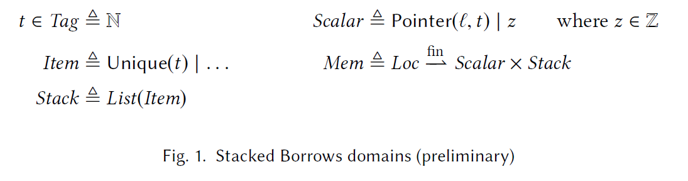

##### Rule(USE-1)

当一个${\rm Pointer}(l,t)$被使用时，在stack中必须找到一个${\rm Unique}(t)$，如果当前栈顶并不是它，不停pop直到栈顶的元素为${\rm Unique}(t)$；如果没找到，那么程序就是有未定义行为

##### Rule(NEW-MUTABLE-REF)

每当通过某个现有的指针${\rm Pointer}(l,t)$创建一个新的可变引用时(&mut T)，首先要考虑该指针被使用了，根据Rule(USE-1)进行处理。随后为该引用创建一个unique的标签$t^{'}$，并新建一个指针${\rm Pointer}(l,t^{'})$，再将${\rm Unique}(t')$ push进stack 


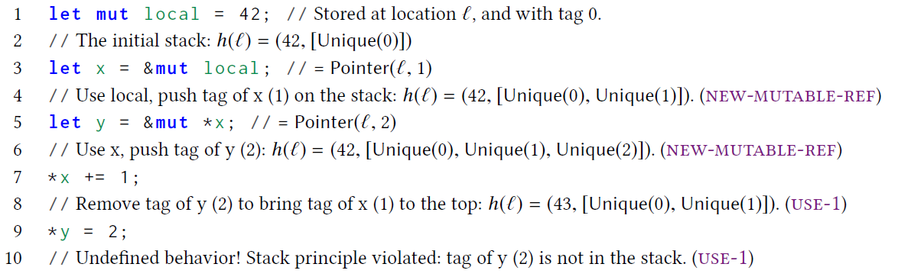


#### 3、考虑raw pointers

和borrow checker不会对raw pointer做检查一样，stacked borrow模型也不会对互为别名的裸指针进行区分，即每个裸指针的标签都是$untagged$，即使用$\perp$表示。


对于前面的例子，若x和y都是裸指针，那么xyxy这个使用序列就变得合法了。但是，如果**其中任意一个是可变引用**时， 我们希望这xyxy的序列会违背stack principle。这样就在后续的优化中，可以保证这样的序列中不会出现可变引用。

为了能够把裸指针添加进borrow stack，添加了另一种模型来代表stack中的item：$\rm SharedRW$（shared read-write），来表示这块内存被share给了所有的裸指针来进行读和写。

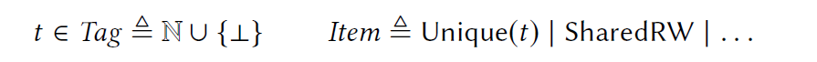

##### Rule(USE-2)

当一个${\rm Pointer}(l,t)$被使用时，如果$t$是$\perp$，在stack中必须找到一个$\rm SharedRW$；如果不是$\perp$，在stack中必须找到一个${\rm Unique}(t)$。如果当前栈顶并不是它，不停pop直到栈顶的元素是想要的；如果没找到，那么程序就是有未定义行为

##### Rule(NEW-MUTABLE-REF)

每当通过一个可变引用(&mut T)创建一个新的裸指针时，该可变引用的值为 ${\rm Pointer}(l,t)$，首先要考虑该可变引用被使用了，根据Rule(USE-2)进行处理。随后为该裸指针新建一个指针${\rm Pointer}(l,\perp)$，再将$\rm SharedRW$ push进stack 

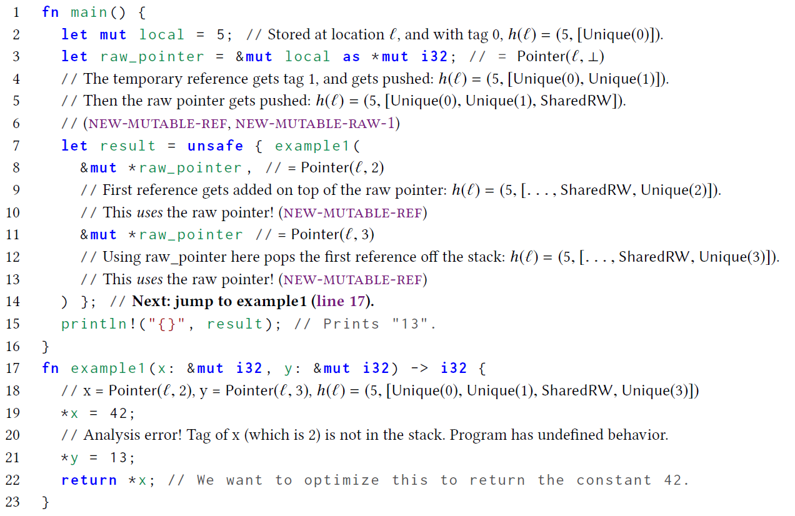 


#### 4、再进一步：retag

上面的例子还有个问题：当给example1传如的两个指针都有相同的标签时（unsafe代码里可以随便copy数据，所以能够搞出两个相同标签的指针），就无法分辨了。所以对于example1中的两个参数，我们需要他俩有不同的标签，并且都是unique的（在前面的例子中做到了这点，其根本目的也是让两个原本同名的裸指针以独占引用形式呈现时能够变成两个不同的tagged pointer）。——unsafe代码可以复制标签，但是没法伪造一个出来。

所以，添加一个$retag$指令，用于保证一个引用有一个全新的标签，这条指令将应用于函数开始执行时，对所有的引用类型参数进行retag

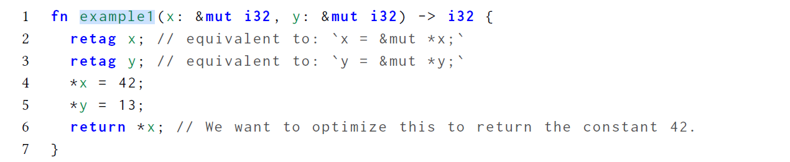

其实retag的功能就是做了个reborrow

todo：上述代码的推导过程

甚至不需要考虑x和y是否互为别名！

只需要看用到了x的地方

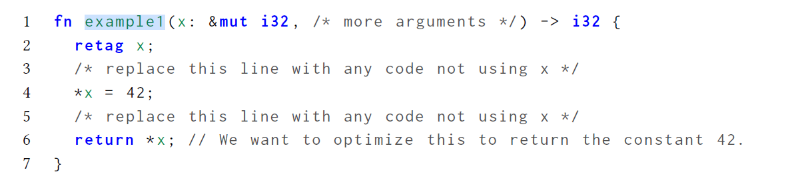


那么x就变成了一个unique pointer！换句话说，没有使用x的代码是绝对不可能影响到x指向的内存的。

这样，从外面传入了一个指针x，这个x就从外面“消失”了，只是当前作用域内的一个unique pointer，并且在代码中调用别的方法时，只要不把x作为该方法的参数传入，我们就可以认为 这个外部方法是一定不会对x造成影响的。


那么，到底什么时候需要进行retag？

- any time a reference gets passed in as an argument
- returned from a function
- read from a pointer

简单来说，当一个引用进入我们目前正在分析的作用域时，就要进行一个retag

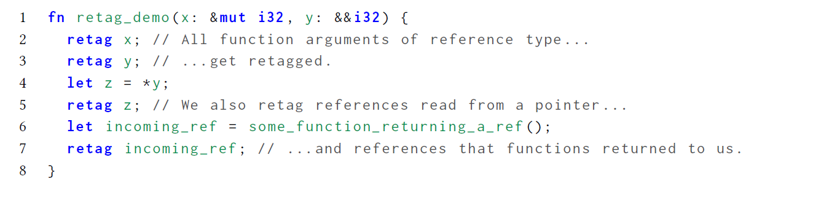


#### 再加上不可变引用shared references

前面的所有操作已经帮助我们**保证了**所有的**可变引用**的uniqueness，接下来还要加入对不可变引用的分析。

borrow checker对可变/不可变引用的约束：

- 任何reference在被创建之后，其使用、以及所有它的reborrow的使用，都只能出现在referent的下一次改动之前

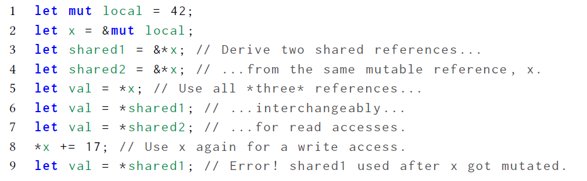

在stack的模型中再添加一种item：shared read-only (t)，表示tag为t的引用只被允许用于read对应的内存；同时给之前对应裸指针的SharedRW，即shared read-write也添加一个tag，这样所有的item都有一个自己的tag。


对于之前push一个SharedRW的操作，也改为push一个SharedRW($\perp$)，其他新的规则：

##### Rule(READ-1)

当一个${\rm Pointer}(l,t)$被read时，在stack中必须找到一个tag为t的item，即${\rm Unique}(t), {\rm SharedRO}(t)$或${\rm SharedRW}(t)$的其中之一。如果找到了一个这样的item，不停pop直到**栈中每一个在其上面的item都是SharedRO(_)**；如果没找到，那么程序就是有未定义行为

##### Rule(NEW-SHARED-REF-1)

每当通过某个现有的指针${\rm Pointer}(l,t)$创建一个新的不可变引用时(&Expr)，首先要考虑该指针被read了，根据Rule(READ-1)进行处理。随后为该引用创建一个unique的标签$t^{'}$，并新建一个指针${\rm Pointer}(l,t^{'})$，再将${\rm SharedRO}(t')$ push进stack 

注意，这里的READ-1规则并没有要求**栈顶是SharedRO**，而是允许其上方存在一些别的SharedRO。这也保证了**所有的SharedRO都只连续地存在于栈顶**。因为每次创建可变引用或裸指针时都会触发一次写的操作，会use到某个指针，从而保证了栈顶的所有SharedRO都被pop掉，只剩SharedRW或Unique

根据上述规则，前面的例子将变成：

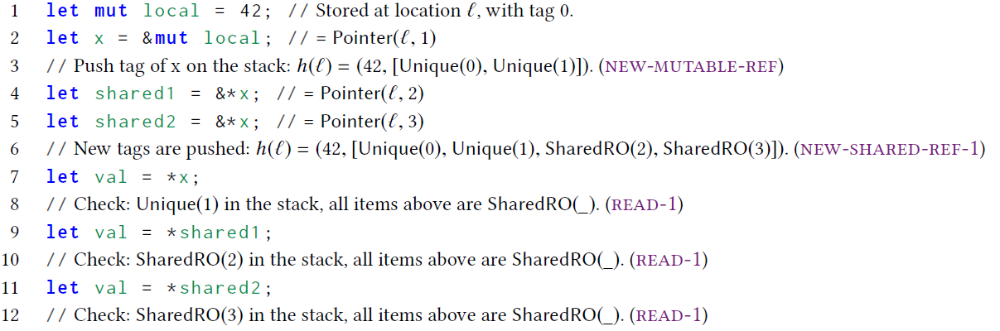

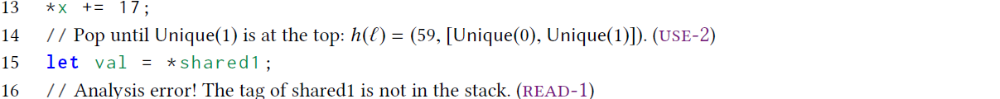

