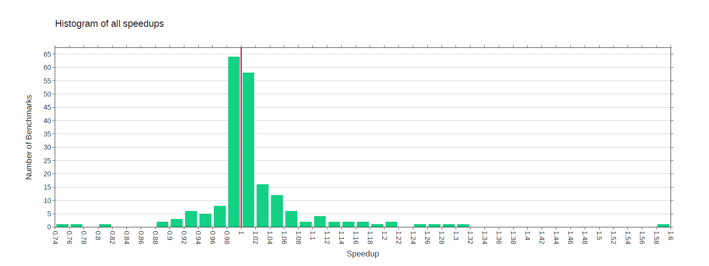
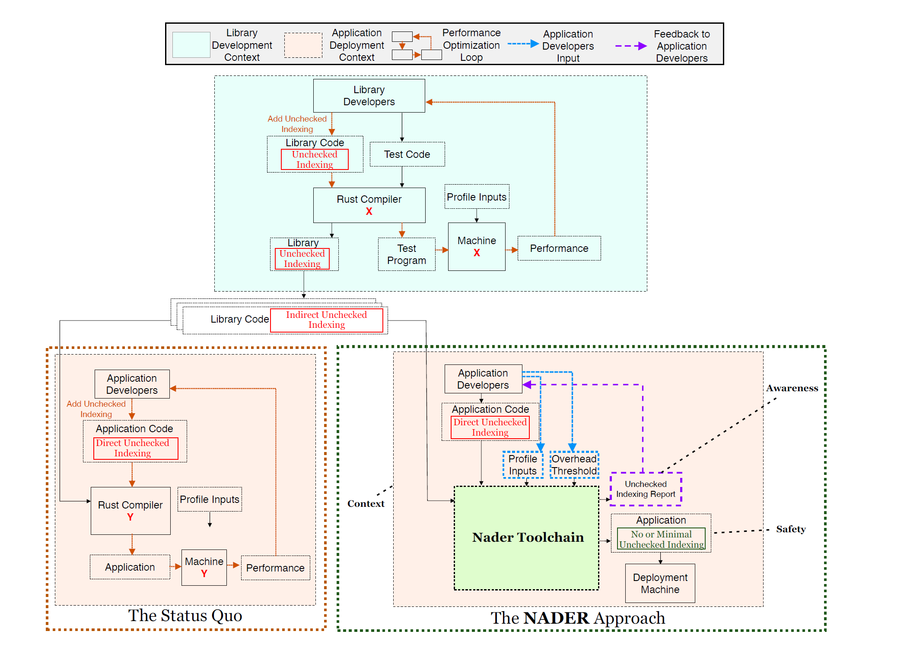
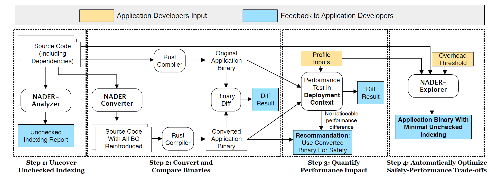

### Motivation

- Memory-safety vulnerability
  - Heart-Bleed vulnerability: OpenSSL有一个叫Heartbeat（心跳检测）的拓展，它允许连接SSL一端的电脑发出一条简短的信息Client Hello问询来检测对方服务器是否正常在线，若服务器返回Server hello，则表明可以正常SSL通讯。
    - 每次问询，A都会向服务器B发送请求包，其中含有包的类型(type)和数据长度(Length)等信息，而服务器B返回一个包含有请求包内容的响应包。
    - 当B收到A的请求包后，并没有的验证A包的实际长度，而是简单的把请求包data中说明的长度当作data的实际长度，于是当请求包中说明的长度与请求包数据实际长度不同时，问题就产生了。
- 类型安全的程序设计语言
  - 保证类型安全，以防止通过缓冲区溢出等方式获取超出指定内存范围的数据 —— bound check
  - 但是，安全性和性能一直是需要做出trade-off的地方，很多语言提供了一些机制让用户越过安全性的限制，并且对于性能敏感的应用，开发者倾向于忽略这些检查。
- Rust中unsafe代码越过slice越界检查——unchecked-indexing
  -  对于safe Rust代码，Rust会在静态期插入检查越界的指令，增加了动态运行时的开销
  - 所以很多用户喜欢使用get_unchecked方法来避免边界检查。
  - 即使是默认要进行边界检查的语言，500个最常用的library中也有10%被人工选择省略检查，甚至这些library中有很多被以safety为priority的应用所使用。
- 对于使用了unchecked indexing的top Rust libraries，76.4%的benchmark显示在给定的上下文下，省略掉边界检查对性能的提升微乎其微。
  - 使用者很难找到真正影响性能的那个indexing操作
  - 并且使用者使用unchecked indexing的时候还可能引发问题
- 27个Rust的应用中，它们的dependencies中使用unchecked indexing的次数是其本身使用次数的86倍。
- 所以，unchecked indexing不应是一种requirement，而应该是一种suggestion。
  - **NADER**：根据用户给出的性能牺牲的阈值，来尽可能还原一些bound check
- 55%的用户会为了性能选择使用unsafe代码
- 22%的unsafe代码是为了性能而写的，其中以unchecked indexing和ptr::copy_nonoverlapping()为主

### Contribution

- 实证研究：用户很难正确地找出哪些bound check是可以去掉的——特别是那些应用于不同上下文的库
- NADER approach：根据用户设置的性能牺牲阈值，来将unchecked indexing转为checked
- 将上述approach应用到真实的benchmark中 

#### Study

1. 使用unchecked indexing是否会对性能带来提升？提升的效果如何？

- copy_checked和copy_unchecked：unchecked快了七倍

203 benchmarks belongs to one of 7 libraries in the top 250 most downloaded Rust libraries on crates.io that a) contains unchecked indexing and b) has a benchmark suite that compiles with rustc-1.52.0

- 结论：Ultimately, while unchecked indexing can improve performance, most of the time it does not
  - 甚至有时候会提升性能
    - 插入一些check指令会防止函数内联，函数内联可能导致cache未命中等问题，反而导致性能下降
    - 同时，插入check指令也可以帮助分支指令的目标地址被对齐到某个特定的字节边界

### Approach

- Awareness: Make application developers aware of unchecked indexing.
- Safety: Improve application safety up to a performance overhead threshold
- Context: Optimize safety-performance trade-offs for an application and deployment context.

